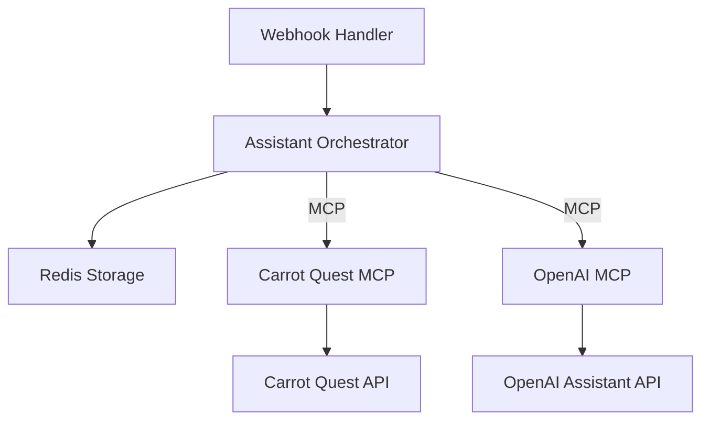

# Panda AI Support

An AI-native first-line support system for melonpanda.com, powered by OpenAI Assistant API and Carrot Quest.

## Overview

Panda AI Support is an intelligent support agent that handles customer inquiries through Carrot Quest's chat interface. The system is designed to be AI-native, with all business logic primarily handled through the OpenAI Assistant API and all external service interactions managed through Model Context Protocol (MCP) servers.

## Key Features

- AI-native support system using OpenAI Assistant API
- Seamless integration with Carrot Quest
- Containerized microservices architecture
- MCP-based external service communication
- Stateless design with minimal data persistence
- Real-time response capabilities
- Intelligent conversation management
- Automatic escalation to human agents when needed

## Architecture

The system is built using a containerized microservices architecture:



For detailed architectural information, see [Architecture Documentation](docs/architecture.md).

## Documentation

- [Architecture Documentation](docs/architecture.md) - Detailed system architecture and technical specifications
- [Agent Description](docs/agent-description.md) - Comprehensive overview of agent capabilities and workflows

## Requirements

- Python 3.11 or higher
- Docker and Docker Compose
- Redis
- Access to Carrot Quest API
- Access to OpenAI API

## Dependencies

Main dependencies:
- MCP CLI tools
- FastAPI
- Redis
- SSE Client

For a complete list of dependencies, see [pyproject.toml](pyproject.toml).

## Getting Started

1. Clone the repository
2. Configure environment variables
3. Start the required MCP servers (Carrot Quest and OpenAI)
4. Launch the application containers:
   ```bash
   docker-compose up -d
   ```

## Configuration

The system requires the following environment variables:

```env
# Carrot Quest Configuration
CARROT_QUEST_TOKEN=your_token_here

# OpenAI Configuration
OPENAI_API_KEY=your_key_here

# Redis Configuration
REDIS_URL=redis://redis:6379/0

# Application Configuration
LOG_LEVEL=INFO
WEBHOOK_SECRET=your_webhook_secret
```

## Development

The project uses several development tools:

- Black for code formatting
- isort for import sorting
- flake8 for linting
- mypy for type checking
- pytest for testing

To set up the development environment:

1. Install development dependencies:
   ```bash
   pip install -e ".[dev]"
   ```

2. Install pre-commit hooks:
   ```bash
   pre-commit install
   ```

## Testing

Run the test suite:

```bash
pytest
```

## License

This project is proprietary software. All rights reserved.

## Support

For support inquiries, please contact the development team.
