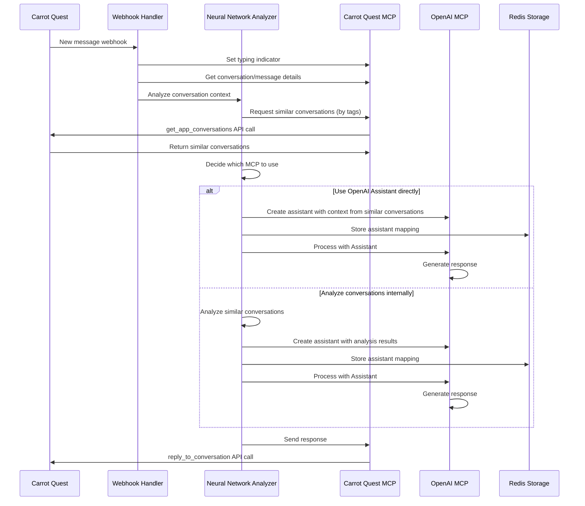
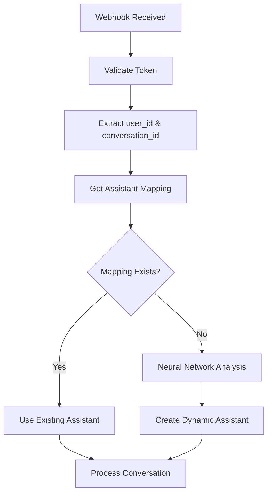
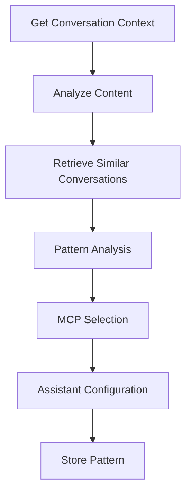
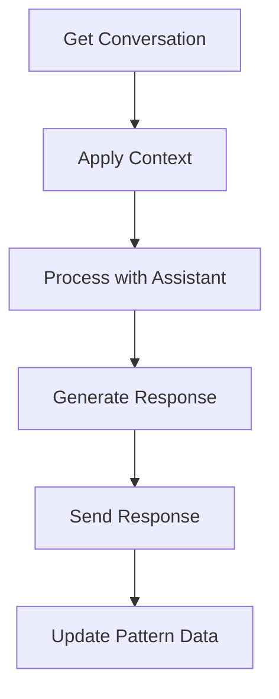

# Panda AI Support Agent Architecture

## Overview
Panda AI Support Agent is an AI-native first-line support system for melonpanda.com, leveraging Carrot Quest for customer interactions and OpenAI's Assistant API for intelligent responses. The system features a neural network analyzer for dynamic MCP selection and assistant creation, with all external API interactions handled through Model Context Protocol (MCP) servers.

## Core Principles

1. **AI-Native Design**
   - Neural network-based decision making
   - Dynamic assistant creation and configuration
   - Business logic primarily handled through OpenAI Assistant API
   - Minimal application logic, focusing on orchestration
   - All external service interactions through MCP tools

2. **Stateless Architecture**
   - No local storage of conversations
   - Minimal state management (user-assistant mappings only)
   - Reliance on external services for data persistence
   - Pattern-based learning without state retention

3. **Containerized Services**
   - Main application container (webhook handler + orchestrator)
   - Neural Network Analyzer container
   - Carrot Quest MCP server container
   - OpenAI MCP server container
   - Redis container (for user-assistant mapping)

## System Components

### 1. Main Application
- **Purpose**: Handles webhooks and orchestrates interactions between components
- **Key Responsibilities**:
  - Webhook validation and processing
  - Assistant orchestration
  - User-assistant mapping management
  - Communication coordination between components
  - SSE connection management

### 2. Neural Network Analyzer
- **Purpose**: Analyzes conversations and determines optimal processing strategy
- **Key Responsibilities**:
  - Conversation context analysis
  - Similar conversation pattern matching
  - MCP selection optimization
  - Assistant configuration generation
  - Learning from successful interactions

### 3. Carrot Quest MCP Server
- **Purpose**: Provides tools for interacting with Carrot Quest API
- **Key Tools**:
  - Conversation management
  - User data access
  - Message handling
  - Event processing
  - Historical conversation retrieval

### 4. OpenAI MCP Server
- **Purpose**: Manages interactions with OpenAI Assistant API
- **Key Tools**:
  - Dynamic assistant creation
  - Thread handling
  - Message processing
  - Response generation
  - Context management

### 5. Redis Storage
- **Purpose**: Lightweight key-value storage for mappings and patterns
- **Stored Data**:
  - User ID to Assistant ID mappings
  - Thread ID associations
  - MCP selection patterns
  - TTL-based expiration for automatic cleanup

## Communication Flow



## Data Flow

### 1. Webhook Processing


### 2. Neural Network Analysis


### 3. Assistant Processing


## MCP Tool Integration

### Carrot Quest MCP Tools
- Conversation management tools
- User data access tools
- Message handling tools
- Event processing tools
- Historical data retrieval tools

### OpenAI MCP Tools
- Dynamic assistant creation tools
- Thread handling tools
- Message processing tools
- Response generation tools
- Context management tools

## Assistant Configuration

### Dynamic Instructions
- Context-based support guidelines
- Pattern-based conversation handling
- Learned escalation criteria
- Response formatting requirements
- Historical success patterns

### Tools Access
- Dynamic MCP tool selection
- Conversation management capabilities
- User data access capabilities
- Pattern-based tool optimization

### Model Configuration
- GPT-4 or equivalent
- Function calling enabled
- Tool use permissions configured
- Pattern-based optimization

## Error Handling

1. **Webhook Failures**
   - Invalid tokens
   - Malformed requests
   - Duplicate webhooks
   - Pattern analysis failures

2. **MCP Communication Errors**
   - Connection timeouts
   - Service unavailability
   - Rate limiting
   - Pattern mismatch errors

3. **Neural Network Issues**
   - Analysis failures
   - Pattern recognition errors
   - Learning inconsistencies
   - Configuration generation errors

4. **Assistant Processing Issues**
   - Response generation failures
   - Tool execution errors
   - Thread management issues
   - Pattern application errors

## Monitoring and Logging

1. **Key Metrics**
   - Neural network accuracy
   - Pattern recognition rate
   - Assistant response time
   - MCP tool usage statistics
   - Learning effectiveness

2. **Log Categories**
   - Webhook events
   - Neural network operations
   - Assistant interactions
   - MCP tool executions
   - Pattern learning events
   - Error events

## Security Considerations

1. **Authentication**
   - Webhook token validation
   - MCP server authentication
   - API key management
   - Pattern access control

2. **Data Protection**
   - No persistent conversation storage
   - Minimal user data retention
   - Secure communication between containers
   - Pattern anonymization

## Deployment Configuration

1. **Container Setup**
   ```yaml
   services:
     app:
       image: panda-ai-support
       depends_on:
         - redis
         - neural-network
         - carrot-quest-mcp
         - openai-mcp
     
     neural-network:
       image: panda-ai-neural-network
       
     carrot-quest-mcp:
       image: carrot-quest-mcp
       
     openai-mcp:
       image: openai-mcp
       
     redis:
       image: redis:alpine
   ```

2. **Network Configuration**
   - Internal container network
   - Exposed webhook endpoint
   - Secure MCP communication
   - Neural network isolation

## Future Considerations

1. **Scalability**
   - Neural network distributed processing
   - Horizontal scaling of main application
   - MCP server load balancing
   - Redis cluster configuration
   - Pattern distribution optimization

2. **Feature Extensions**
   - Enhanced pattern recognition
   - Additional MCP tool integration
   - Advanced neural network capabilities
   - Enhanced monitoring and analytics
   - Pattern-based optimization

3. **Performance Optimization**
   - Neural network efficiency
   - Response time improvements
   - Resource usage optimization
   - Pattern matching optimization
   - Learning rate enhancement
