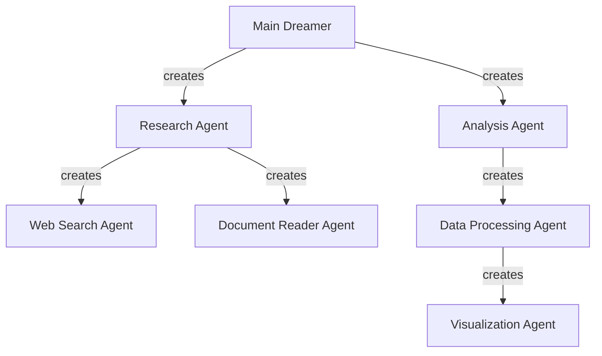

# Dreamer Agent

## What is a Dreamer Agent?

A Dreamer Agent is a universal, LLM-driven, self-organizing agent that dynamically plans, decomposes, and executes complex tasks through recursive subagent creation. Unlike traditional agents with predefined workflows, Dreamers leverage the reasoning capabilities of large language models to autonomously determine what agents are needed, create them on-the-fly, and orchestrate their execution—all without human intervention beyond the initial task description.

Dreamers represent a paradigm shift in agent architecture: rather than humans designing static agent workflows, the LLM itself becomes the architect, dynamically constructing and managing an evolving agent graph tailored to each unique task. This approach enables unprecedented flexibility, adaptability, and problem-solving capabilities.

## Core Principles

### LLM as Planner and Executor

The foundation of a Dreamer Agent is the LLM's ability to:
- **Plan**: Analyze tasks, identify necessary steps, and design an execution strategy
- **Decompose**: Break complex problems into manageable subproblems
- **Create**: Dynamically generate specialized subagents for specific subtasks
- **Orchestrate**: Manage dependencies, execution flow, and result aggregation
- **Adapt**: Modify plans and create new agents as circumstances change

### Dynamic Agent Graph

Dreamers use PocketFlow as their execution engine, enabling:
- **Runtime Graph Construction**: The agent graph is built dynamically during execution, not predefined
- **Action-Based Transitions**: Agents can branch, loop, or create new execution paths based on results
- **Hierarchical Composition**: Subagents can create their own subagents, forming a recursive agent hierarchy
- **Flow-as-Node Pattern**: Entire workflows can be encapsulated and reused as single nodes

### Reasoning Cache

To maintain context and enable recovery:
- **Persistent Context**: All reasoning steps and decisions are cached
- **Progress Tracking**: Execution state is continuously tracked
- **Failure Recovery**: Agents can resume from the last successful state after failures
- **Context Preservation**: Long-running tasks maintain coherence through cached reasoning

### Parallelism and Autonomy

For efficient execution and minimal human intervention:
- **Concurrent Execution**: Independent subagents run in parallel
- **Autonomous Decision-Making**: Agents decide their own next steps without human guidance
- **Self-Coordination**: Agents manage their own dependencies and synchronization
- **Asynchronous Processing**: I/O-bound operations are optimized through async execution

### MCP Integration

For universal interoperability:
- **Standardized Tool Interface**: All external interactions occur through MCP
- **Vendor Agnosticism**: No direct dependency on specific APIs or services
- **Universal Embedding**: Dreamers can be embedded in any agent supporting MCP
- **Extensible Tooling**: New capabilities can be added through MCP servers

## Dreamer Agent Lifecycle

### 1. Task Reception

The Dreamer lifecycle begins when a task is received through:
- Direct API call to the Dreamer endpoint
- MCP tool invocation from an external agent
- Webhook or event trigger

The task includes a description of the goal and any relevant context or constraints.

### 2. LLM-Driven Planning

The LLM analyzes the task and:
- Develops a high-level plan for accomplishing the goal
- Identifies necessary subagents and their responsibilities
- Determines dependencies and execution order
- Designs the initial agent graph structure

This planning occurs through the OpenAI Assistant API, with the LLM using tool_calls to communicate its plan.

### 3. Dynamic Subagent Creation

Based on the LLM's plan:
- The runtime creates PocketFlow nodes for each planned subagent
- Each subagent is configured with specific instructions and tools
- The agent graph is constructed according to the planned structure
- Initial shared context is established

Subagents are created through tool_calls from the LLM, with the backend dynamically instantiating the corresponding PocketFlow nodes.

### 4. Execution and Monitoring

During execution:
- Subagents run according to the graph structure, potentially in parallel
- Each agent's reasoning and results are cached
- The LLM monitors progress and adapts the plan as needed
- New subagents may be created to handle emerging requirements
- The agent graph evolves dynamically

### 5. Result Aggregation

As subagents complete their tasks:
- Results are collected and organized
- The LLM synthesizes a coherent final output
- Execution metrics and insights are gathered
- The reasoning cache is finalized for potential future reference

### 6. Recovery and Resumption

If failures occur:
- The reasoning cache identifies the last successful state
- The LLM analyzes the failure and adjusts the plan
- Execution resumes from the appropriate point
- The agent graph may be restructured to avoid similar failures

## Key Capabilities

### Recursive Agent Creation

Dreamers can:
- Create specialized subagents for specific subtasks
- Allow those subagents to create their own subagents
- Build arbitrarily deep agent hierarchies
- Maintain coherent context across all levels

### Parallel Execution

For efficiency, Dreamers:
- Identify independent subtasks that can run concurrently
- Manage dependencies to maximize parallelism
- Coordinate result aggregation from parallel branches
- Balance resource usage across concurrent agents

### Persistent Reasoning Context

To maintain coherence:
- All reasoning steps are cached with their context
- Decisions and their rationales are preserved
- Intermediate results are stored for reference
- Context is accessible across the agent hierarchy

### Extensible Tool Integration

Dreamers can:
- Access any tool provided through MCP
- Dynamically select the most appropriate tools for each task
- Combine tools in novel ways to solve complex problems
- Request new tool capabilities when needed

### Universal Embedding via MCP

As an MCP-native system, Dreamers:
- Can be embedded in any agent supporting MCP
- Provide standardized interfaces for task submission and result retrieval
- Maintain consistent behavior across different hosting environments
- Enable seamless integration with existing agent ecosystems

## Comparison to Traditional Agents

| Aspect | Traditional Agents | Dreamer Agents |
|--------|-------------------|---------------|
| **Workflow Definition** | Static, predefined by humans | Dynamic, created by LLM at runtime |
| **Adaptability** | Limited to programmed paths | Can create new execution paths as needed |
| **Agent Creation** | Fixed set of agents | Dynamically creates specialized agents |
| **Failure Handling** | Predefined error paths | Adaptive recovery with context preservation |
| **Parallelism** | Usually limited or manual | Automatic identification of parallel opportunities |
| **Context Management** | Often stateless or limited | Comprehensive reasoning cache |
| **Integration** | Custom per-system | Universal via MCP |
| **UI Requirements** | Often tied to specific interfaces | No UI required, can be embedded anywhere |
| **Problem Scope** | Typically domain-specific | Open-ended, general problem solving |

## Use Cases

Dreamer Agents excel at:

1. **Complex, Multi-step Tasks**
   - Research projects requiring diverse information sources
   - Data analysis workflows with unpredictable paths
   - Creative tasks with iterative refinement

2. **Autonomous Problem Solving**
   - Troubleshooting with dynamic diagnostic steps
   - Planning and optimization problems
   - Exploratory tasks with unclear initial paths

3. **Integration Scenarios**
   - Connecting multiple services and APIs
   - Translating between different data formats and systems
   - Orchestrating workflows across organizational boundaries

4. **Adaptive Learning Tasks**
   - Continuously refining approaches based on results
   - Exploring solution spaces with feedback loops
   - Building knowledge bases through iterative discovery

## Future Directions

The Dreamer Agent paradigm opens possibilities for:

- **Meta-Learning**: Dreamers that improve their planning and execution strategies over time
- **Collaborative Dreamers**: Multiple Dreamer instances working together on complex problems
- **Specialized Dreamers**: Domain-specific Dreamers with tailored planning strategies
- **Human-Dreamer Collaboration**: Frameworks for effective human guidance of Dreamer processes
- **Persistent Dreamers**: Long-running Dreamers that maintain context across multiple sessions
