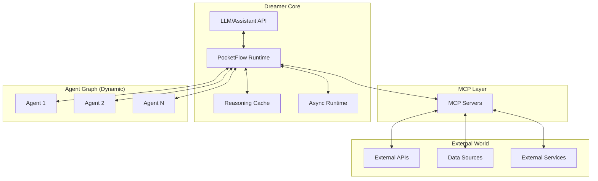
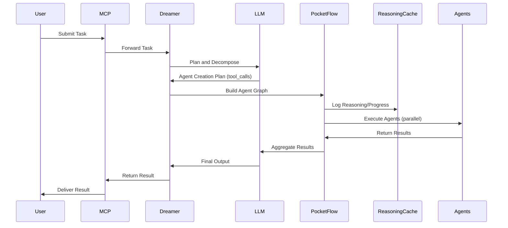

# Dreamer Architecture

## Overview

The Dreamer architecture is a universal, LLM-driven agent orchestration system that enables dynamic creation and management of agent workflows. Built on PocketFlow's graph-based execution engine and OpenAI's Assistant API, Dreamers represent a paradigm shift from static, human-designed agent systems to dynamic, LLM-designed agent networks that evolve in response to tasks.

Unlike traditional architectures with predefined components and workflows, the Dreamer architecture is fundamentally generative—the LLM itself designs the agent network at runtime, creating specialized agents as needed and orchestrating their execution. This approach enables unprecedented flexibility, adaptability, and problem-solving capabilities while maintaining robustness through reasoning caches and recovery mechanisms.

---

## Core Components

### LLM/Assistant API

The "brain" of the Dreamer architecture:
- **Planning**: Analyzes tasks and designs execution strategies
- **Agent Creation**: Specifies new agents and their responsibilities
- **Tool Calling**: Interacts with external systems via MCP
- **Reasoning**: Makes decisions based on context and results
- **Synthesis**: Aggregates results into coherent outputs

The Dreamer uses OpenAI's Assistant API with tool_calls to communicate its plans and agent creation requests to the runtime system.

### PocketFlow Runtime

The "nervous system" that executes the LLM's plans:
- **Dynamic Graph Construction**: Builds and modifies the agent graph at runtime
- **Flow Orchestration**: Manages execution paths and transitions
- **Action-Based Routing**: Directs flow based on agent outputs
- **Hierarchical Composition**: Supports nested flows and agent hierarchies
- **Parallel Execution**: Runs independent agents concurrently

PocketFlow provides the lightweight, flexible execution engine that brings the LLM's plans to life.

### Reasoning Cache

The "memory" that enables persistence and recovery:
- **Context Storage**: Maintains the full reasoning context
- **Progress Tracking**: Records execution state and results
- **Recovery Points**: Enables resumption after failures
- **Pattern Recognition**: Supports learning from past executions
- **State Persistence**: Optionally persists to external storage (Redis, DB)

The reasoning cache ensures that no context is lost and execution can recover from failures.

### MCP Integration Layer

The "sensory system" connecting to the external world:
- **Standardized Tool Interface**: Uniform access to external capabilities
- **Resource Abstraction**: Consistent access to external data
- **Vendor Agnosticism**: No direct dependency on specific APIs
- **Universal Embedding**: Enables integration with any MCP-compatible system
- **Extensible Tooling**: Supports adding new capabilities via MCP servers

MCP provides the standardized interface for all external interactions.

### Async Runtime

The "muscles" that execute tasks efficiently:
- **Concurrent Processing**: Manages parallel agent execution
- **I/O Optimization**: Handles asynchronous operations efficiently
- **Resource Management**: Balances load across concurrent agents
- **Synchronization**: Coordinates dependent operations
- **Throttling**: Manages rate limits and resource constraints

The async runtime ensures efficient execution even with complex, parallel agent graphs.

---

## Component Diagram

---

## Execution Flow

1. **Task Reception**
   - Task arrives via MCP, API, or event trigger.
   - Initial context and constraints are provided.

2. **LLM Planning**
   - LLM (Assistant API) analyzes the task.
   - Plans the agent graph: decomposes the problem, defines subagents, and their dependencies.
   - Issues tool_calls to request agent creation and tool usage.

3. **Dynamic Agent Graph Construction**
   - PocketFlow runtime creates nodes for each agent/subagent as specified by the LLM.
   - The agent graph is built and connected according to the plan.

4. **Execution and Monitoring**
   - Agents execute their assigned tasks, possibly in parallel.
   - Each agent's reasoning and results are cached.
   - The LLM monitors progress, adapts the plan, and may create new agents as needed.

5. **Result Aggregation**
   - Results from all agents are collected and synthesized by the LLM.
   - Final output is returned to the requester.

6. **Recovery and Resumption**
   - If failures occur, the reasoning cache enables resumption from the last successful state.
   - The LLM can replan or restructure the agent graph as needed.

---

## Reasoning Cache and Recovery

- **All agent reasoning, decisions, and results are logged.**
- **Progress is tracked at each node in the agent graph.**
- **Failures trigger recovery logic, allowing the system to resume or replan.**
- **Persistent storage (e.g., Redis) can be used for long-running or distributed deployments.**
- **The cache enables auditability, debugging, and learning from past executions.**

---

## Parallelism and Scalability

- **Independent agents/subagents are executed concurrently using the async runtime.**
- **Dependencies are managed by PocketFlow, ensuring correct execution order.**
- **The system can scale horizontally by distributing agent execution across resources.**
- **Parallel execution maximizes throughput and reduces latency for complex tasks.**

---

## MCP Integration

- **Dreamer exposes a standardized MCP interface for task submission and result retrieval.**
- **All external tool usage (APIs, databases, services) is mediated through MCP servers.**
- **Dreamer can be embedded as a universal agentic runtime in any MCP-compatible system.**
- **New tools and integrations can be added by registering additional MCP servers.**

---

## Security and Compliance

- **No persistent storage of sensitive data unless explicitly configured.**
- **All communication between components is secured.**
- **Access control and authentication are enforced at the MCP and API layers.**
- **Compliance with privacy and data protection standards is supported by design.**

---

## Extensibility and Future Directions

- **New agent types, tools, and planner strategies can be added without changing the core architecture.**
- **Support for additional LLMs, vector databases, and external services is straightforward via MCP.**
- **Meta-learning and self-improving planners can be layered on top of the Dreamer core.**
- **Collaborative Dreamers and persistent, long-running agent graphs are possible.**
- **The architecture is designed for continuous evolution and integration with emerging AI capabilities.**

---

## Example: End-to-End Dreamer Flow

---

## Summary

The Dreamer architecture enables a new class of agentic systems where the LLM is not just a tool user, but the architect and orchestrator of dynamic, evolving agent networks. By combining LLM-driven planning, PocketFlow's flexible execution, persistent reasoning caches, and universal MCP integration, Dreamer systems can tackle open-ended, complex, and adaptive tasks with minimal human intervention and maximal extensibility.
